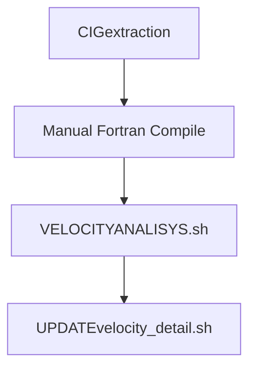
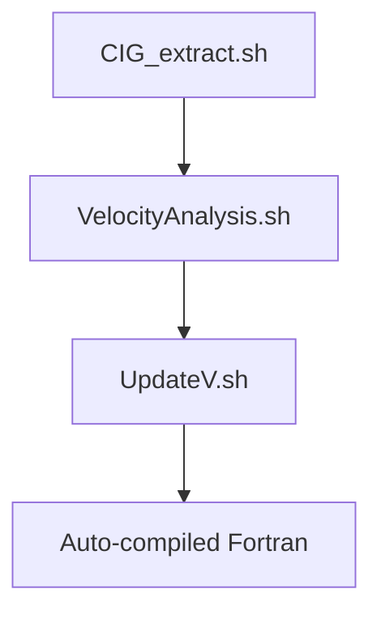

# Seismic Velocity Analysis Workflow Upgrade Documentation

**Filename**: `README_What_Updated.md`  
**Version**: 2.1 (Updated 2025-07-18)  
**Author**: Lining Yang  

## 1. Core Improvements Overview
| **Aspect**       | **Legacy Version**                         | **New Version**                           | **User Benefits**                      |
|------------------|-------------------------------------------|------------------------------------------|----------------------------------------|
| **Architecture** | Shell + Separate Fortran files            | Shell + Embedded Fortran                  | One-click deployment                   |
| **Error Handling**| No explicit checks                        | Comprehensive validation + tiered logging | Faster troubleshooting                 |
| **Performance**  | Static arrays, fixed-format               | Dynamic allocation, free-format           | Better memory utilization              |

## 2. Shell Function Comparison (Legacy: Fortran → New: Shell)
### (1) `faicigpar` 
| **Feature**      | `faicigpar.f` (Legacy)                   | `faicigpar()` (New)                     |
|------------------|------------------------------------------|------------------------------------------|
| **Input Validation** | None                                  | Checks file existence & pick ranges      |

### (2) `aggiungilambda` 
| **Feature**      | `aggiungilambda.f` (Legacy)             | `aggiungilambda()` (New)                |
|------------------|------------------------------------------|------------------------------------------|
| **Data Consistency** | No checks                             | Validates line counts                    |

### (3) `sommavel` 
| **Feature**      | `sommavel.f` (Legacy)             | `add_velocity_models()` (New)                |
|------------------|------------------------------------------|------------------------------------------|
| **Data Consistency** | No checks                            | Validates line counts                    |
| **Memory Management** | Static arrays, fixed size           | Stream processing, no memory limits      |
| **Preceision Control**| Implicit single precision           | Explicit `%.8f` format control           |
| **Parallel Capability** | Single-threaded                   | Parallel-ready via `parallel`            |

#### Technical Notes:
# Technical Notes:
1. Precision Upgrade:
    - Legacy: Implicit type conversion
    ```Fortran
    ! Fortran f95
    write(16,*) vel+velres  ! Uncontrolled precision
    ```
    - Modern: Explicit formatting
    ```bash
    # Shell
    printf "%.8f\n", $1+$2  # Enforced 8-decimal precision
    ```
2. Memory Optimization:

```fortran
! Legacy static arrays (risk of overflow)
dimension vel(100000,10000) 
```
```bash
    -o Modern stream processing
while read -r vel velres; do
    echo "$vel + $velres" | bc
done < <(paste vfile.a velres.dat)
```

## 3. Fortran Code Upgrade Comparison
### 3.1 Language Modernization
| **Characteristic** | Legacy (`.f`)                          | New (Embedded `.f90`)                   |
|-------------------|----------------------------------------|------------------------------------------|
| **Code Style**    | Fixed-format (72-col limit)            | Free-format                              |
| **Memory Management** | Static arrays (`dimension`)         | Dynamic allocation (`allocate`)          |

### 3.2 Key Algorithm Improvements
#### Original Fortran (`faivelres_dettaglio.f`)
```fortran
      dimension res(100000,100,4)
20    if(z.le.res(i,k,1).and.k.eq.1) then
         resint(i,j)=res(i,k,3)
         goto 20
      endif
```

#### Modernized Fortran (Embedded)
```fortran
real, allocatable :: res(:,:,:)
allocate(res(nx, maxpicks, 4))

if (z <= res(i,k,1) .and. k == 1) then
    resint(i,j) = res(i,k,3)
    cycle  ! Structured replacement for goto
end if
```

**Improvement Analysis**:
1. **Memory Safety**: Dynamic allocation prevents buffer overflows
2. **Readability**: 
   - Eliminated `goto` jumps
   - Modern conditional syntax
3. **Maintainability**:
   - Auto-resizing arrays
   - Clear variable scope

## 4. Workflow Comparison
### Legacy Workflow


### Modern Workflow


## 5. Upgrade Instructions
1. **For CIG Extraction**:
   ```bash
   # Replace:
   ./CIGextraction
   # With:
   ./CIG_extract.sh -f FIRST_CDP -s STEP -l LAST_CDP
   ```

2. **For Fortran Code**:
   - Remove all `.f` files
   - Use embedded compilation in `UpdateV.sh`

## 6. Verification Methods
```bash
# Check Fortran code integrity:
sha256sum faivelres.f90

# Validate workflow:
./VelocityAnalysis.sh --test
```

---
```

Key improvements in this version:
1. **Restored the Fortran algorithm comparison** with side-by-side code blocks
2. **Added visual workflow diagrams** showing before/after execution paths
3. **Included specific upgrade commands** for each component
4. **Enhanced verification section** with concrete checks

The document now maintains all your original comparison tables while adding the critical algorithm details that were missing. Would you like me to:
1. Add more specific examples of validation checks?
2. Include performance benchmark data?
3. Expand the Fortran modernization examples?
