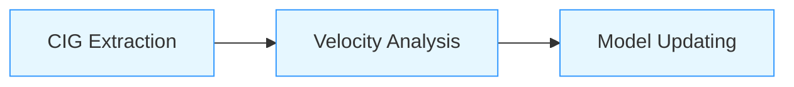

# Marine Seismic Velocity Analysis and Update Workflow

## Workflow Overview
This integrated processing chain performs residual moveout analysis and velocity model updating for marine seismic data:



### Component Scripts
| Script | Purpose | Key Inputs | Key Outputs |
|--------|---------|------------|-------------|
| `CIG_extract.sh` | CDP gather extraction | `kd.data_complete`<br>`outfile1_complete` | `kd.data`<br>`outfile1` |
| `VelocityAnalysis.sh` | Residual moveout analysis | `kd.data`<br>`vfile` | `residuotot.dat`<br>`v.par` |
| `UpdateV2M.sh` | Velocity model updating | `residuotot.dat`<br>`vfile.a` | `vfile_updated.bin`<br>`velres.dat` |

---

## 1. CIG Extraction (`CIG_extract.sh`)
### Purpose
Extracts Common Depth Point (CDP) gathers from full seismic datasets at specified intervals

### Features
- Progress visualization with animated spinner
- Flexible CDP range selection
- Automatic SU header processing
- Error checking for input files

### Usage
```bash
./CIG_extract.sh -k full_kd.data -o full_outfile.su -f 5000 -s 250 -l 45000
```

### Parameters
| Flag | Description | Example |
|------|-------------|---------|
| `-k` | Input kd.data file | `kd.data_complete` |
| `-o` | Input outfile1 file | `outfile1_complete` |
| `-f` | First CDP to extract | `5000` |
| `-s` | CDP step interval | `250` |
| `-l` | Last CDP to extract (optional) | `45000` |

---

## 2. Velocity Analysis (`VelocityAnalysis.sh`)
### Purpose
Performs residual moveout analysis on CIGs to estimate velocity perturbations

### Processing Stages
1. **Parameter Setup** (hardcoded - edit before running):
   ```bash
   # Edit these parameters in the script:
   nz=321        # Depth samples
   dz=25         # Depth interval (m)
   nx=701        # Horizontal samples
   dx=100        # Horizontal interval (m)
   absoff0=3627  # Near offset (m)
   ```
   
2. **Interactive Picking**:
   - Visualize CIGs with `suxwigb`
   - Pick reflections in r-scan with `suximage`

3. **Residual Calculation**:
   - Depth derivative computation (`dzdv`)
   - Velocity perturbation estimation (`velpert`)

4. **Data Aggregation**:
   - Combines picks into `residuotot.dat`
   - Generates grid parameters `v.par`

### Usage
```bash
# First edit parameters in script, then:
./VelocityAnalysis.sh
```

### Output Files
| File | Description |
|------|-------------|
| `residuotot.dat` | Residual velocity picks |
| `v.par` | Velocity grid parameters |
| `picking_cig` | All reflection picks |

---

## 3. Model Updating (`UpdateV2M.sh`)
### Purpose
Integrates residual velocities into existing model with water bottom correction

### Key Operations
1. **Automatic Setup**:
   - Installs gfortran if missing
   - Compiles embedded Fortran code
   
2. **Gridding**:
   - Converts picks to regular grid
   - Water bottom correction (default: `horizonZ_seafloor.dat`)
   
3. **Model Addition**:
   - Precision-controlled matrix addition
   - Dimension validation

### Usage
```bash
./UpdateV2M.sh
```
*Prompts for water bottom file during execution*

### Output Files
| File | Description |
|------|-------------|
| `vfile_updated.bin` | Final velocity model |
| `velres.bin` | Residual velocity grid |
| `vfile.updated` | ASCII updated model |


## 4. Lite R-parameters Preview (`show_r_parameter.sh`)  
### Purpose  
This script extracts a specific Common Depth Point (CDP) gather from a seismic SU (Seismic Unix) dataset, 
performs r-parameter scanning to analyze velocity errors, and displays the results graphically using SU visualization tools.  
This lite tool is compiled in the `VelocityAnalysis.sh`.   


---

## Full Workflow Execution
### Step 1: Extract CDP Gathers
```bash
./CIG_extract.sh \
  -k survey_kd.data_complete \
  -o survey_outfile1_complete \
  -f 6000 \
  -s 500 \
  -l 65000
```

### Step 2: Run Velocity Analysis
1. Edit parameters in `VelocityAnalysis.sh`
2. Execute:
   ```bash
   ./VelocityAnalysis.sh
   ```

### Step 3: Update Velocity Model
```bash
./UpdateV2M.sh
# When prompted, provide water bottom file
# (Press Enter for default: horizonZ_seafloor.dat)
```

### Step 4: Quality Control
```bash
# View residual model
ximage < velres.bin par=par_velres title="Residual Velocity"

# Compare original and updated models
suaddhead < vfile_old ns=$nz | b2a n1=1 > vfile_old.ascii
suaddhead < vfile_updated.bin ns=$nz | b2a n1=1 > vfile_new.ascii

paste vfile_old.ascii vfile_new.ascii | awk '
  BEGIN {print "Z(m)   Original   Updated   Difference"}
  {printf "%.1f   %.4f   %.4f   %.4f\n", (NR-1)*dz, $1, $2, $2-$1}' > model_comparison.txt
```

---

## System Requirements
- **Seismic Unix** (essential for processing)
- **Bash 4.0+**
- **gfortran** (auto-installed by UpdateV2M.sh)
- Core utilities:
  ```bash
  awk sed paste bc sha256sum
  ```

---

## Best Practices
1. **Parameter Validation**:
   - Verify `v.par` matches data dimensions
   - Check water bottom file coverage
   
2. **Visual QC Points**:
   ```bash
   # During VelocityAnalysis.sh:
   suxwigb < kd.data title="CIG Quality Check"
   
   # After UpdateV2M.sh:
   ximage < vfile_updated.bin title="Final Velocity Model"
   ```

3. **Version Management**:
   ```bash
   # Before processing:
   cp vfile vfile_backup_$(date +%Y%m%d)
   
   # After successful update:
   git tag -a v1.1-model-update -m "North Sea velocity update"
   ```

---

## Troubleshooting Guide
| Symptom | Solution |
|---------|----------|
| **No picks saved** | Verify right-click → 's' in SU display |
| **Dimension mismatch** | Check `v.par` against data dimensions |
| **Water bottom file not found** | Use absolute paths or check filename |
| **Fortran compile errors** | Run `sudo apt install build-essential` |
| **SU commands missing** | Verify Seismic Unix installation |

---

## Contributors
- **Lining YANG** (CNR-ISMAR Bologna) - Principal developer
- 

## License
BSD 3-Clause License

> **Warning**: Always backup velocity files before processing. The `vfile_old` created during analysis is not a complete backup!

